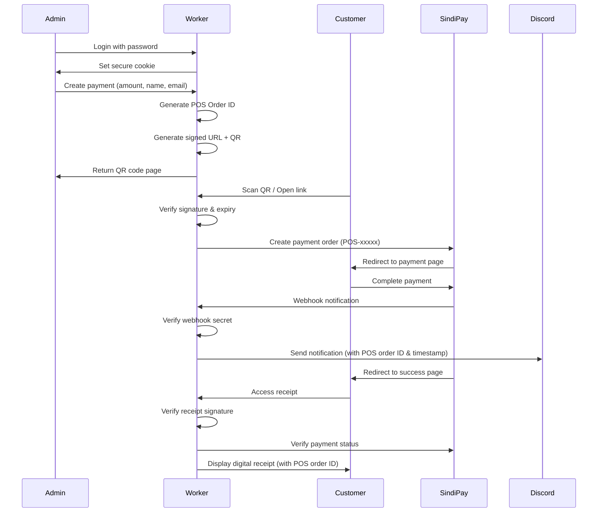

# Serverless Cloudflare POS Terminal

<div align="center">

<a href="https://developers.cloudflare.com/workers/"></a> <a href="https://developer.mozilla.org/en-US/docs/Web/JavaScript"></a> <a href="https://nodejs.org/"></a> <a href="https://sindipay.com/en/"></a> <a href="https://discord.com/"></a>

</div>

A **zero-infrastructure**, **serverless** Point of Sale (POS) system built to run on **Cloudflare Workers**. This lightweight payment terminal allows authenticated administrators to generate secure, time-limited payment links with QR codes for customers.

**Powered by SindiPay**
We integrate with [SindiPay](https://sindipay.com/en/) to provide robust payment infrastructure with an easy-to-integrate API for developers.

> **Domain note (Testing vs Production):**
> This repo may use **`sindipay.xyz`** in code examples for **testing/sandbox** purposes.
> For **production/live payments**, you should switch back to **`sindipay.com`**.

---

## 🌟 Key Features

### 🔐 Security

* **Zero Trust Authentication** - Password-protected dashboard with secure, HttpOnly, SameSite=Strict cookies
* **Tamper-Proof Links** - Uses HMAC-SHA256 digital signatures to ensure payment links and receipts cannot be forged or altered
* **Time-Sensitive Security**

  * Payment Links expire after **30 minutes**
  * Receipts remain accessible for **48 hours**
* **Context Separation** - Different signature types (PAY/RCT) prevent signature reuse across contexts
* **Webhook Validation** - Secret-based webhook authentication ensures only legitimate payment notifications are processed
* **Receipt URL Privacy (v1.1.1)** - Final receipt URLs are **sanitized** (no customer name/email in the browser URL), while still displaying them on the receipt page

### 💳 Payment Processing

* **SindiPay Integration** - Seamless integration with SindiPay payment gateway
* **QR Code Generation** - Automatic QR code creation for easy mobile payments
* **Real-time Verification** - Payment status verification directly with gateway API
* **Order ID Tracking** - Custom POS order IDs (POS-xxxxx) for easy transaction tracking
* **Multiple Currency Support** - Currently configured for IQD (Iraqi Dinar), easily adaptable

### 📱 User Experience

* **Responsive Mobile-First UI** - Optimized for iOS and mobile devices with native-like experience
* **PWA Ready** - Installable as a web app with custom icons and splash screens
* **Dark Mode Design** - Modern dark theme optimized for OLED displays
* **Digital Receipts** - Canvas-based receipt generation with sharing capabilities
* **Error Recovery** - User-friendly error messages with merchant contact options

### 🔔 Notifications

* **Discord Webhooks** - Real-time transaction notifications to Discord channels
* **Rich Embeds** - Formatted transaction details with status indicators and POS order IDs
* **Robust Timestamp Handling** - Supports multiple timestamp formats (Unix, ISO 8601, milliseconds)
* **Timezone Support** - Timestamps displayed in GMT+3 (Asia/Baghdad timezone, configurable)

### ⚙️ Customization

* **Branding Support** - Custom merchant name, logo, and contact information
* **Email Integration** - Optional email receipt functionality
* **WhatsApp Integration** - Direct customer support via WhatsApp
* **Flexible Configuration** - All settings managed through environment variables

---

## 📋 Table of Contents

* [Architecture](#-architecture--security-logic)
* [Environment Variables](#%EF%B8%8F-environment-variables)
* [Setup & Deployment](#-setup--deployment)
* [Usage Guide](#-usage-guide)
* [Security Features](#-security-features)
* [API Routes](#-api-routes)
* [Troubleshooting](#-troubleshooting)
* [Contributing](#-contributing)
* [License](#-license)

---

## 🏗 Architecture & Security Logic

### Digital Signatures (HMAC)

The system uses `crypto.subtle` to generate **HMAC-SHA256** signatures:

```javascript
// Signature format: HMAC-SHA256(TYPE-data, WEBHOOK_SECRET)
// Where TYPE is either "PAY" or "RCT"
```

**Benefits:**

* Any parameter change invalidates the signature
* Requests with invalid signatures are automatically rejected
* Context separation using prefixes prevents signature reuse:

  * `PAY-` prefix for payment links (30-minute validity)
  * `RCT-` prefix for receipts (48-hour validity)

A payment link signature **cannot** be reused to fake a receipt, even if stolen.

### Receipt URL Privacy (v1.1.1)

Starting from **v1.1.1**, the **final receipt URL** is sanitized:

* ✅ Receipt URL does **not** expose customer name/email in the query string
* ✅ Receipt page still shows customer name/email
* ✅ Discord webhook still receives customer name/email

How it works (stateless):

* Instead of putting `name`/`email` into `/success`, the worker places customer details into an **encrypted token** (for example `c=`) using `WEBHOOK_SECRET`.
* The receipt signature binds to that token rather than raw PII fields.
* The `/success` route decrypts the token to render customer details.

> This keeps the project **stateless** (no database) while keeping PII out of the visible URL.

### Payment Flow



### Security Layers

1. **Authentication Layer** - Secure cookie-based session management
2. **Signature Layer** - HMAC-SHA256 validation for all payment links
3. **Temporal Layer** - Time-based expiration for links and receipts
4. **Webhook Layer** - Secret-based webhook authentication
5. **Gateway Layer** - Real-time verification with payment gateway

---

## ⚙️ Environment Variables

Configure these in Cloudflare Workers as **Secrets** or in `wrangler.toml`:

| Variable Name         | Description                                                                                        | Required       | Example                                |
| --------------------- | -------------------------------------------------------------------------------------------------- | -------------- | -------------------------------------- |
| `TERMINAL_PASSWORD`   | Password for dashboard login                                                                       | ✅ Yes          | `your-secure-password-123`             |
| `WEBHOOK_SECRET`      | Random string for HMAC signatures & webhook auth (**also used for receipt URL privacy in v1.1.1**) | ✅ Yes          | `random-secret-key-xyz789`             |
| `API_KEY`             | Your SindiPay API key                                                                              | ✅ Yes          | `sp_live_xxxxxxxxxxxxxxxx`             |
| `MERCHANT_NAME`       | Your business/merchant name                                                                        | ⚠️ Recommended | `My Shop`                              |
| `MERCHANT_EMAIL`      | Contact email for customer support                                                                 | ⚠️ Recommended | `support@myshop.com`                   |
| `MERCHANT_WHATSAPP`   | WhatsApp number (with country code, no +)                                                          | ⚠️ Recommended | `1234567890`                           |
| `MERCHANT_LOGO`       | URL to your logo/icon (180x180 recommended)                                                        | ⚪ Optional     | `https://example.com/logo.png`         |
| `DISCORD_WEBHOOK_URL` | Discord webhook URL for notifications                                                              | ⚪ Optional     | `https://discord.com/api/webhooks/...` |

### Setting up Environment Variables

#### Using Wrangler CLI (Recommended for Secrets):

```bash
# Required secrets
npx wrangler secret put TERMINAL_PASSWORD
npx wrangler secret put WEBHOOK_SECRET
npx wrangler secret put API_KEY

# Optional secrets
npx wrangler secret put DISCORD_WEBHOOK_URL
```

#### Using wrangler.toml (for non-sensitive config):

```toml
name = "my-pos-terminal"
main = "index.js"
compatibility_date = "2024-01-01"

[vars]
MERCHANT_NAME = "My Shop"
MERCHANT_EMAIL = "support@myshop.com"
MERCHANT_WHATSAPP = "1234567890"
MERCHANT_LOGO = "https://example.com/logo.png"
```

---

## 🚀 Setup & Deployment

### Prerequisites

* [Cloudflare Account](https://dash.cloudflare.com/sign-up) (Workers are free for up to 100,000 requests/day)
* [Node.js](https://nodejs.org/) v16+ and npm
* [Wrangler CLI](https://developers.cloudflare.com/workers/wrangler/install-and-update/)
* [SindiPay Account](https://sindipay.com/en/) with API key

### Installation Steps

#### 1. Clone the Repository

```bash
git clone https://github.com/h190k/posterminal.git
cd posterminal
```

#### 2. Install Dependencies

```bash
npm install
```

#### 3. Configure Your Project

Edit `wrangler.toml`:

```toml
name = "my-pos-terminal"  # Change to your worker name
main = "index.js"
compatibility_date = "2024-01-01"

[vars]
MERCHANT_NAME = "Your Shop Name"
MERCHANT_EMAIL = "your-email@domain.com"
MERCHANT_WHATSAPP = "1234567890"  # Your number with country code, no +
```

#### 4. Set Up Secrets

```bash
# Generate a random webhook secret
npx wrangler secret put WEBHOOK_SECRET
# Enter a random string like: 3k9s0d8fh2j4k5l6m7n8

# Set your terminal password
npx wrangler secret put TERMINAL_PASSWORD
# Enter your desired password

# Set your SindiPay API key
npx wrangler secret put API_KEY
# Enter your SindiPay API key

# Optional: Set Discord webhook
npx wrangler secret put DISCORD_WEBHOOK_URL
# Enter your Discord webhook URL
```

#### 5. Deploy to Cloudflare

```bash
npx wrangler deploy
```

Your POS terminal will be live at: `https://my-pos-terminal.your-subdomain.workers.dev`

#### 6. (Optional) Custom Domain

In the Cloudflare Dashboard:

1. Go to Workers & Pages
2. Select your worker
3. Go to Settings → Triggers
4. Add Custom Domain

---

## 📱 Usage Guide

### For Merchants (Admin)

1. **Access Dashboard**

   * Navigate to your worker URL
   * Enter your `TERMINAL_PASSWORD`
   * You'll be logged in for 2 minutes (Zero Trust)

2. **Create Payment Request**

   * Enter the amount
   * Optionally add customer name and email
   * Click "Create Request"
   * System generates unique POS order ID (POS-xxxxx)

3. **Share Payment Link**

   * Show the QR code to customer
   * Or use "Share Link" / "Copy Link" buttons
   * Link expires in 30 minutes

4. **Monitor Transactions**

   * Check Discord for real-time notifications (if configured)
   * Each payment triggers an embed with:

     * POS Order ID (POS-xxxxx)
     * Transaction timestamp (GMT+3)
     * Payment status
     * Customer details
     * Amount

### For Customers

1. **Make Payment**

   * Scan QR code or open payment link
   * Redirected to SindiPay payment page
   * Complete payment using preferred method

2. **View Receipt**

   * Automatically redirected to receipt page
   * Receipt shows:

     * POS Order ID
     * Transaction date/time (GMT+3)
     * Payment amount and status
     * Customer information
   * Can share or email receipt
   * Receipt accessible for 48 hours

---

## 🔒 Security Features

### Authentication

* **Zero Trust Model**: 2-minute session timeout
* **HttpOnly Cookies**: Protected from XSS attacks
* **Secure Flag**: HTTPS-only transmission
* **SameSite=Strict**: CSRF protection

### Link Security

* **HMAC-SHA256 Signatures**: Cryptographic validation
* **Timestamp Validation**: Prevents replay attacks
* **Context Separation**: Different signatures for different purposes
* **URL Parameter Binding**: Any modification breaks signature

### Webhook Security

* **Secret Validation**: Only authenticated webhooks processed
* **Request Verification**: Validates request source

### Data Protection

* **No Database Required**: Stateless architecture
* **Minimal Data Storage**: No persistent customer data
* **Gateway Verification**: All payments verified with source

---

## 🛣 API Routes

| Route       | Method | Auth Required | Description                                            |
| ----------- | ------ | ------------- | ------------------------------------------------------ |
| `/`         | GET    | ✅ Yes         | Dashboard / Terminal                                   |
| `/login`    | POST   | ❌ No          | Authentication endpoint                                |
| `/generate` | POST   | ✅ Yes         | Create payment link with POS order ID                  |
| `/pay`      | GET    | ❌ No          | Process payment (validates signature)                  |
| `/success`  | GET    | ❌ No          | Receipt page (validates signature, shows POS order ID) |
| `/webhook`  | POST   | ❌ No (Secret) | SindiPay webhook handler (sends Discord notification)  |

---

## 🛠 Troubleshooting

### "Gateway Firewall Block" Error

**What's happening**: SindiPay's API returned HTML instead of JSON, typically due to Cloudflare's security challenge page.

**Fix**:

* This is temporary protection on SindiPay's side
* Wait 5 minutes, then try creating a new payment link
* If persistent, check your worker's IP reputation or contact SindiPay support

**Debug tip**: Check your worker logs - you'll see HTML content starting with `<!DOCTYPE`

---

### Using `sindipay.xyz` vs `sindipay.com`

If you're testing, you might see the gateway domain as `sindipay.xyz`.
That is intended for sandbox/testing.

✅ **Production:** use `https://sindipay.com/...`
🧪 **Testing:** use `https://sindipay.xyz/...`

---

### "Link Expired" Error

**What's happening**: The payment link has passed its 30-minute validity window.

**Fix**:

* Generate a fresh payment link from your dashboard
* Remind customers to complete payments within 30 minutes
* If you need longer validity, adjust `TIME_PAY_LINK` constant in the code

**Note**: This is a security feature - expired links cannot be reactivated, only replaced.

---

### "Receipt Expired" Error

**What's happening**: The receipt link is older than 48 hours and has been invalidated.

**Fix**:

* Receipts are designed to expire for security
* Customer should use the email/WhatsApp buttons to contact you
* You can still verify the transaction in SindiPay's dashboard using the Order ID
* To extend receipt validity, modify `TIME_RECEIPT` constant

**Best practice**: Advise customers to screenshot or save receipts before expiration.

---

### "Invalid Signature" / "Security Check Failed"

**What's happening**: The URL signature doesn't match the expected HMAC-SHA256 hash.

**Common causes**:

1. Customer manually edited URL parameters
2. URL was corrupted during copy/paste
3. Link was generated with a different `WEBHOOK_SECRET`
4. Signature type mismatch (PAY vs RCT)

**Fix**:

* Always generate new links - never manually modify URLs
* If you recently changed `WEBHOOK_SECRET`, old links are permanently invalid
* Check your worker logs to see which parameter failed validation

**Security note**: This error is intentional - it prevents link tampering attacks.

---

### Discord Notifications Not Appearing

**Diagnostic checklist**:

1. **Verify webhook URL**

   ```bash
   npx wrangler secret list
   # Should show DISCORD_WEBHOOK_URL
   ```

2. **Test webhook directly**

   ```bash
   curl -X POST "YOUR_DISCORD_WEBHOOK_URL" \
     -H "Content-Type: application/json" \
     -d '{"content": "Test message"}'
   ```

3. **Check Discord permissions**

   * Webhook must have "Send Messages" permission
   * Channel must not be archived
   * Webhook hasn't been deleted/regenerated

4. **Check worker logs**

   ```bash
   npx wrangler tail
   ```

   Look for errors in the `/webhook` route

**If notifications work but timestamp shows "N/A"**:

* SindiPay might be sending timestamps in an unexpected format
* Check the webhook payload in your logs
* The system supports: Unix seconds (10 digits), Unix milliseconds (13 digits), and ISO 8601 strings
* Falls back to current server time if parsing fails

---

### Discord Shows Wrong Order ID

**If you see internal payment IDs (e.g., "100710") instead of your POS IDs (e.g., "POS-1735142400000")**:

**This was a bug fixed in v1.1.0**. Update your worker to the latest version:

```bash
git pull origin main
npx wrangler deploy
```

**How it works now**:

* System prioritizes `data.order_id` from webhook payload
* Falls back to `data.id` only if order_id is missing
* Your custom POS order IDs should now appear correctly in Discord

**Verify the fix**: Create a test payment and check Discord - you should see "Order ID: POS-xxxxx"

---

### "Transaction Not Found" on Receipt Page

**What's happening**: The payment ID in the URL doesn't exist in SindiPay's system.

**Debugging steps**:

1. **Check if payment was actually completed**

   * Log into SindiPay dashboard
   * Search for the transaction by amount/date

2. **Verify API key is correct**

   ```bash
   npx wrangler secret list
   # Ensure API_KEY is set
   ```

3. **Check worker logs for API errors**

   ```bash
   npx wrangler tail
   ```

   Look for 404 responses from SindiPay

4. **Common causes**:

   * Customer abandoned payment before completion
   * Payment failed but customer followed success URL anyway
   * API key doesn't have access to this transaction
   * Transaction was on a different SindiPay account

**Fix**: If payment was completed but not found, contact SindiPay support with the payment_id from the URL.

---

### Worker Returns "System Error: ..."

**These indicate code-level issues**. Check your worker logs:

```bash
npx wrangler tail --format pretty
```

**Common errors**:

* `Cannot read property 'X' of undefined` → Missing environment variable
* `Failed to fetch` → Network issue with SindiPay API
* `Invalid JSON` → Corrupted webhook payload
* `Signature generation failed` → `WEBHOOK_SECRET` not set

**General debugging**:

1. Verify all required secrets are set
2. Check Cloudflare Workers status page
3. Test locally with `npx wrangler dev`
4. Review recent code changes if you modified the worker

---

## 🔧 Customization

### Change Link Expiration Times

Edit the constants at the top of `index.js`:

```javascript
const TIME_PAY_LINK = 30 * 60 * 1000;      // 30 minutes
const TIME_RECEIPT  = 48 * 60 * 60 * 1000; // 48 hours
```

### Change Currency

Edit the SindiPay API call in the `/pay` route:

```javascript
currency: "IQD",  // Change to your currency code
```

### Change Timezone for Discord/Receipts

Edit the timezone in the webhook handler and receipt generation:

```javascript
timeZone: 'Asia/Baghdad'  // Change to your timezone
// Examples: 'America/New_York', 'Europe/London', 'Asia/Tokyo'
```

### Customize UI Colors

Edit the CSS variables in the `STYLES` constant:

```css
:root {
  --bg: #000;      /* Background color */
  --text: #fff;    /* Text color */
  --sub: #555;     /* Subdued text */
  --border: #222;  /* Border color */
}
```

### Customize Order ID Format

Edit the order ID generation in the `/pay` route:

```javascript
order_id: `POS-${Date.now()}`  // Change 'POS' to your prefix
// Examples: `SHOP-${Date.now()}`, `ORDER-${Date.now()}`
```

### Switch SindiPay domain (test vs production)

Search in `index.js` and replace:

* `https://sindipay.xyz/...` (testing)
* `https://sindipay.com/...` (production)

### Add More Payment Gateways

The architecture supports multiple gateways. To add another:

1. Create a new route handler
2. Implement signature generation
3. Add gateway-specific API calls
4. Update webhook handler

---

## 🤝 Contributing

Contributions are welcome! Here's how you can help:

1. **Fork the repository**
2. **Create a feature branch** (`git checkout -b feature/amazing-feature`)
3. **Commit your changes** (`git commit -m 'Add amazing feature'`)
4. **Push to the branch** (`git push origin feature/amazing-feature`)
5. **Open a Pull Request**

### Development Setup

```bash
# Clone your fork
git clone https://github.com/h190k/posterminal.git

# Install dependencies
npm install

# Run locally (requires wrangler login)
npx wrangler dev

# Test in browser
open http://localhost:8787
```

### Reporting Issues

Found a bug or have a feature request? Please:

1. Check existing issues first
2. Provide detailed description
3. Include reproduction steps
4. Add error messages/screenshots if applicable

---

## 📝 Recent Updates

### v1.1.1 (25.12.2025 December 2025)

* ✅ **Receipt URL privacy**: customer name/email are no longer exposed in `/success` URL query parameters
* ✅ **Still shareable receipts**: the receipt link remains usable across browsers/devices while PII stays hidden in an encrypted token
* ✅ **No database required**: kept the worker stateless; uses existing `WEBHOOK_SECRET`
* ✅ **Cross-check on decrypt**: when the token is decrypted, the worker verifies the `oid` (Order ID) inside the encrypted blob matches the `oid` in the URL
* ✅ **Random order IDs**: introduces a `generateRandomString()` helper to create random `order_id` values (example: `POS-aB12...`)
* ✅ **Cleaner config**: groups merchant settings into a single `config` object at the start of each request (logo/name/email/whatsapp, etc.)

### v1.1.0 (23.12.2025 December 2025)

* ✅ **Fixed Discord timestamp display** - Now correctly shows transaction time in GMT+3
* ✅ **Fixed Discord Order ID** - Now shows POS order IDs (POS-xxxxx) instead of internal payment IDs
* ✅ **Improved timestamp parsing** - Supports Unix timestamps (seconds/milliseconds), ISO 8601, and automatic fallback
* ✅ **Enhanced error handling** - Better timezone support and date validation

---

## 📄 License

This project is licensed under the **MIT License** - see the [LICENSE](LICENSE) file for details.

### What this means:

* ✅ Commercial use allowed
* ✅ Modification allowed
* ✅ Distribution allowed
* ✅ Private use allowed
* ⚠️ Liability: Software is provided "as is"
* ⚠️ Warranty: No warranty provided

---

## 🙏 Acknowledgments

* **[SindiPay](https://sindipay.com/)** - Payment gateway infrastructure
* **[Cloudflare Workers](https://workers.cloudflare.com/)** - Serverless platform
* **[QR Server API](https://goqr.me/api/)** - QR code generation

---

## 💖 Support the Project

Love this project? Here's how you can help:

* ⭐ **Star the repo** to show your support
* 🍴 **Fork it** and extend the features
* 🐛 **Report bugs** or suggest improvements via GitHub Issues
* 📢 **Share it** with merchants who need a lightweight POS solution
* 💬 **Join discussions** and help other users

---

If my projects make your life easier, consider supporting development. Your support helps me create more open-source tools for the community.

<div align="center">

[](https://donation.h190k.com/)

[](https://nowpayments.io/donation?api_key=J0QACAH-BTH4F4F-QDXM4ZS-RCA58BH)

</div>

---

<div align="center">

**Built with ❤️ for the open-source community**

[Report Bug](https://github.com/h190k/posterminal/issues) · [Request Feature](https://github.com/h190k/posterminal/issues) · [Documentation](https://github.com/h190k/posterminal/wiki)

</div>
